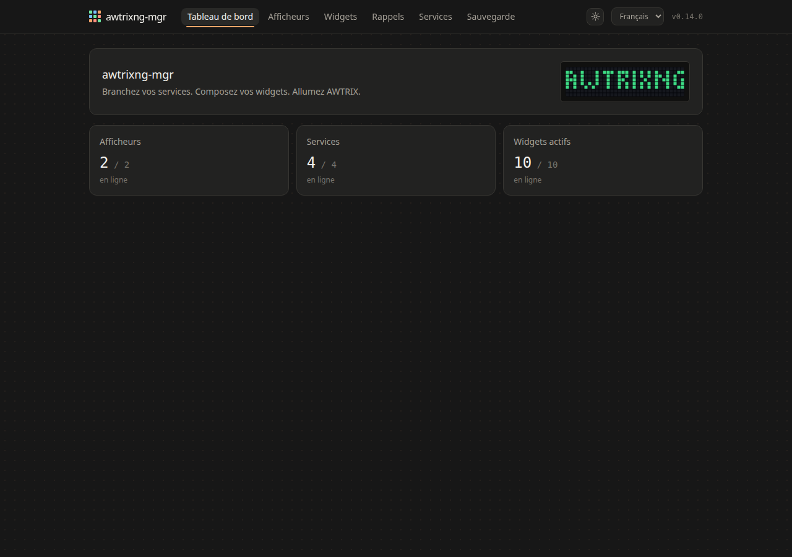
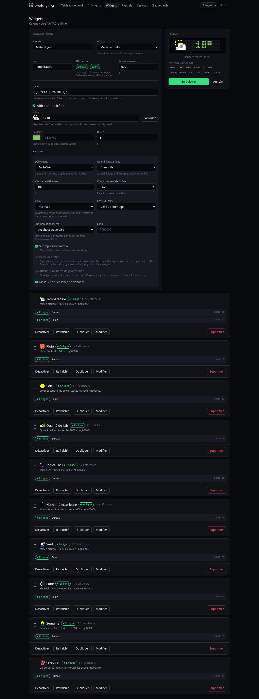
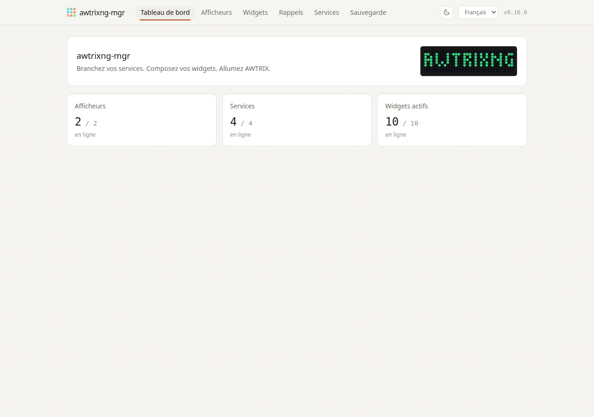

# awtrixng-mgr

**Français** · [English](README.md)

**Donnez à votre horloge AWTRIX NG quelque chose à dire.**

Une application web auto-hébergée qui va chercher la météo, la qualité de
l'air, le prix du carburant, les vacances scolaires ou la phase de la lune, et
les compose en apps sur un ou plusieurs afficheurs
[AWTRIX NG](https://github.com/Blueforcer/awtrix-ng). Plus les rappels : un
message, à une heure, sur les horloges de votre choix.

Pas de compte, pas de nuage, pas d'abonnement. Un `docker compose up` sur votre
réseau.



---

## Démarrage rapide

Il vous faut une horloge AWTRIX NG joignable sur le réseau, et Docker.

```bash
git clone https://github.com/<vous>/awtrixng-mgr.git
cd awtrixng-mgr
docker compose up -d --build
```

Ouvrez `http://<l-hote>/`, puis :

1. **Afficheurs → Ajouter un AWTRIX.** Donnez le nom réseau de l'horloge,
   par exemple `awtrix-salon.lan`. « Tester la connexion » doit afficher sa
   version de firmware.
2. **Services → Météo.** Cherchez votre ville. Aucune clé d'API : Open-Meteo
   est ouvert.
3. **Widgets → Ajouter.** Choisissez le service, choisissez « Météo actuelle »,
   enregistrez.

L'app part sur l'horloge dans la seconde et prend sa place dans la rotation.

**Avant de l'exposer à qui que ce soit**, posez un mot de passe — voir
[Sécurité](docs/manuel/Securite.md). Sans lui, tout le monde sur votre réseau
peut lire vos identifiants de services.

Le [guide de démarrage](docs/manuel/Demarrage.md) reprend tout cela avec les
captures d'écran.

## Ce que ça affiche

| | |
|---|---|
| **Météo** | température, pluie à venir, humidité, vent, lever et coucher du soleil, avec les surimpressions natives de NG — il pleut sur le texte quand il pleut dehors |
| **Qualité de l'air** | indice européen et les cinq polluants ; indice UV sur l'échelle de l'OMS |
| **Carburants** | le moins cher autour de chez vous, depuis les données ouvertes françaises |
| **Vacances scolaires** | semaine A/B et décompte, zones françaises |
| **Lune** | phase et illumination |
| **Rappels** | à heure fixe, avec mélodie, répétition et compte à rebours |

Chaque widget se règle : gabarit de texte, icône, couleur, police, défilement,
barre de progression, effets. Un aperçu montre ce que la dalle fera **avant**
d'enregistrer — la police y est celle du firmware, relevée sur le matériel.



## Ce qui rend ce projet un peu différent

**Tout a été mesuré sur une vraie horloge.** L'API d'AWTRIX NG n'est pas
documentée exhaustivement : chaque route, chaque clé de payload a été poussée
sur une Ulanzi TC001 et relue sur la dalle. Ce qui est accepté sans effet —
et il y en a — n'est pas proposé dans l'interface. Les relevés bruts sont dans
[`docs/ng-api/`](docs/ng-api/).

**Les pannes trouvées sont devenues des tests.** Pas des correctifs : des
tests qui nomment la panne. Une sauvegarde qui ne contenait pas les rappels,
un proxy qui gardait une adresse morte, une option d'affichage qu'aucun
contrôle ne pouvait régler — chacune a son test, et le
[CHANGELOG](CHANGELOG.md) raconte comment elle a été trouvée.

**Clair ou sombre**, aligné sur la charte d'AWTRIX NG — ses propres couleurs,
relevées dans l'interface que le firmware sert lui-même.



## Manuel

Dans [`docs/manuel/`](docs/manuel/README.md) :

- [Démarrage](docs/manuel/Demarrage.md) — de l'horloge nue au premier widget
- [Widgets](docs/manuel/Widgets.md) — les options d'affichage en détail
- [Météo](docs/manuel/Widget-Meteo.md) · [Carburants](docs/manuel/Widget-Carburants.md)
- [Rappels](docs/manuel/Rappels.md) — messages à heure fixe
- [Afficheurs](docs/manuel/Afficheurs.md) — régler l'horloge elle-même
- [Sécurité](docs/manuel/Securite.md) · [Sauvegarde et maintenance](docs/manuel/Maintenance.md)
- [Dépannage](docs/manuel/Depannage.md) — les symptômes qui ne désignent rien
- [Ce que NG change](docs/manuel/AWTRIX-NG.md) — si vous venez d'AWTRIX 3

Pour qui veut regarder sous le capot :
[`docs/architecture.md`](docs/architecture.md) pour les décisions et leurs
raisons, [`docs/ng-api/`](docs/ng-api/) pour l'API mesurée.

## Configuration

Tout se règle dans l'interface. Le fichier `.env` ne porte que ce qui doit
exister avant le premier démarrage — voir
[`.env.example`](.env.example), qui commente chaque ligne.

Les deux à connaître :

```ini
# Mot de passe de l'interface. Vide = aucune authentification.
AWTRIXNG_PASSWORD=

# Afficheurs que les outils en ligne de commande doivent refuser d'écrire.
# Vide par défaut. À remplir le jour où vous en avez deux.
AWTRIXNG_PROTECTED_HOSTS=
```

## Développement

```bash
cd backend && python -m venv .venv && .venv/bin/pip install -e ".[dev]"
.venv/bin/python -m pytest          # ~990 tests, aucun matériel requis
cd ../frontend && npm install && npm run dev
```

Les tests qui écrivent sur une vraie horloge sont écartés par défaut :

```bash
AWTRIXNG_TEST_HOST=awtrix-labo.lan .venv/bin/python -m pytest -m device
```

Ils refusent tout afficheur listé dans `AWTRIXNG_PROTECTED_HOSTS`.

## Versions

| Niveau | Quand | Conséquence |
|---|---|---|
| Correctif `0.1.x` | défaut corrigé, interface ajustée, doc complétée | `git pull && docker compose up -d --build` |
| Mineur `0.x.0` | nouveau widget, nouveau service, migration de base | automatique, mais du neuf apparaît |
| Majeur `x.0.0` | variable obligatoire, format de sauvegarde incompatible | **une action de votre part** |

## Remerciements

- [**AWTRIX NG**](https://github.com/Blueforcer/awtrix-ng) de Blueforcer, le
  firmware sans lequel rien de tout ceci n'aurait d'objet. Ce projet n'en
  contient aucune ligne : il dialogue avec son API HTTP.
- [**Open-Meteo**](https://open-meteo.com), [**data.economie.gouv.fr**](https://data.economie.gouv.fr)
  et [l'API des vacances scolaires](https://data.education.gouv.fr), ouverts et
  sans clé.
- [**LaMetric**](https://developer.lametric.com) pour la galerie d'icônes. Les
  icônes ne sont jamais redistribuées : l'horloge va les chercher elle-même.

## Licence

Copyright © 2026 Florian Picard — [GNU AGPL v3](LICENSE).

Vous pouvez l'utiliser, le modifier, l'héberger. Si vous en faites un service
accessible par le réseau, vous devez en publier les modifications. C'est la
raison d'être de ce choix : ces outils existent parce que leurs équivalents
commerciaux sont hors de prix, et cette licence est celle qui empêche d'en
refaire un produit fermé.

AWTRIX NG, lui, est sous
[PolyForm Noncommercial](https://github.com/Blueforcer/awtrix-ng) — une licence
distincte, qui s'applique au firmware et non à ce projet.
