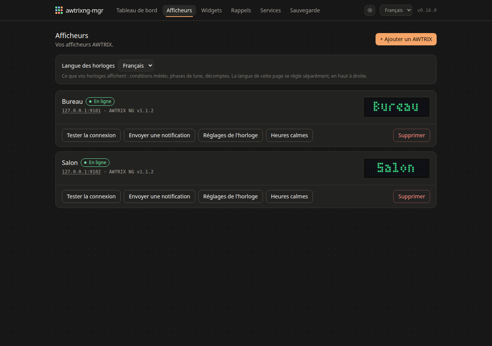
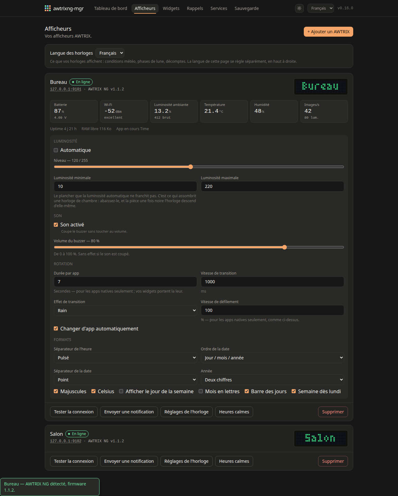
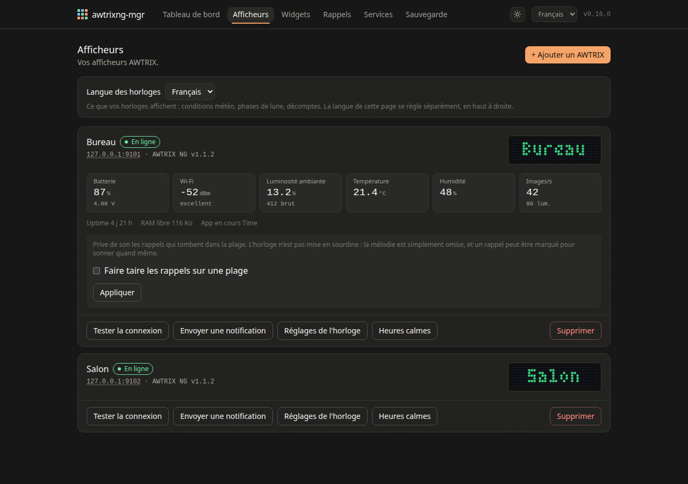

# Afficheurs

Une horloge, ses mesures, ses réglages.

## Les six mesures

Elles n'apparaissent qu'après un **Tester la connexion**, et sont celles que
l'horloge affiche dans sa propre interface, dans le même ordre.

| Tuile | Seconde ligne |
|---|---|
| Batterie | la tension réelle |
| Wi-Fi | la qualité en mots — le dBm ne parle à personne |
| Luminosité ambiante | la valeur brute du capteur |
| Température, Humidité | — |
| Images/s | la luminosité courante |

Et une ligne de pied : uptime, RAM libre, app en cours. Elle affiche aussi
**« Matrice éteinte »** en rouge quand le panneau est coupé — le seul cas que
l'aperçu ne peut pas montrer, puisque le firmware continue de dessiner derrière
des LED éteintes.

## Réglages de l'horloge

Ce sont les réglages de l'appareil, pas ceux d'awtrixng-mgr. Seuls ceux qui
changent vraiment quelque chose sont proposés ; la calibration des couleurs et
le matériel audio absent du TC001 sont volontairement absents.

**Luminosité minimale** mérite une mention à part : c'est le plancher sous
lequel la luminosité automatique ne descend pas. **C'est ce qui assombrit une
horloge de chambre.** Abaissez-le, et une fois la pièce noire l'horloge
descend d'elle-même — elle suit la lumière, pas l'heure, donc elle baisse quand
vous vous couchez vraiment.

**Son activé** coupe le buzzer sans toucher au volume. AWTRIX 3 n'avait que le
volume, qu'il fallait mettre à zéro puis se rappeler de remettre.

## Heures calmes

Une plage pendant laquelle les rappels sonnent **sans leur mélodie**. L'horloge
n'est pas mise en sourdine : la mélodie est simplement omise, et un rappel peut
être marqué pour sonner quand même — le réveil de 6 h 30, typiquement.

Elle **n'assombrit plus rien** : c'est « Luminosité minimale » qui s'en charge,
plus haut, et mieux. Ce qui reste ici est la moitié qu'un capteur de lumière ne
peut pas faire, parce que le silence est une affaire d'heure.

La plage peut passer minuit : 22:00 à 07:00 fonctionne.

**Rien n'est écrit sur l'horloge.** Il n'y a rien à écrire — AWTRIX NG n'a
aucune notion d'horaire — donc rien à restaurer, et rien qui reste derrière si
awtrixng-mgr s'arrête.

## Envoyer une notification

Un essai immédiat, qui interrompt la rotation. Utile pour vérifier qu'une
icône est installée, ou qu'une mélodie RTTTL est bien formée — le firmware
analyse la mélodie et dit où elle a buté.

## Plusieurs horloges

Un widget peut viser plusieurs afficheurs : il est **collecté une fois** et
poussé sur chacun. Chaque afficheur garde son propre état, donc un widget peut
très bien fonctionner sur l'un et échouer sur l'autre, et le dire.

## Langue des horloges

En haut de la page. Elle règle les **mots poussés sur la matrice** — conditions
météo, phases de lune, décomptes. La langue de l'interface se règle séparément,
en haut à droite : votre navigateur peut être en anglais et vos horloges en
français.
