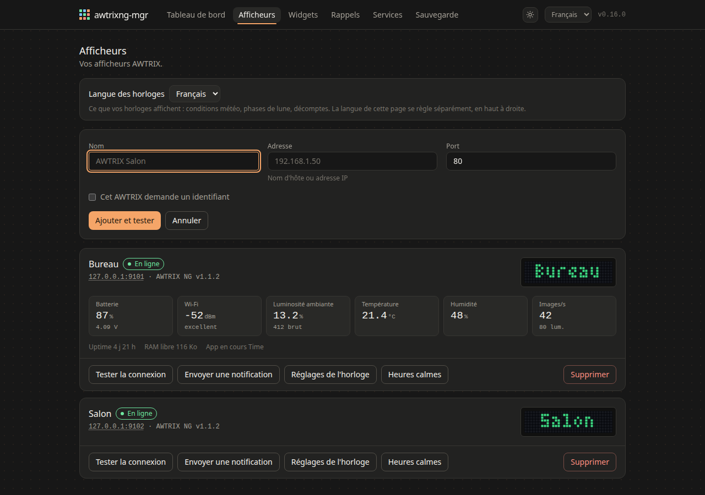
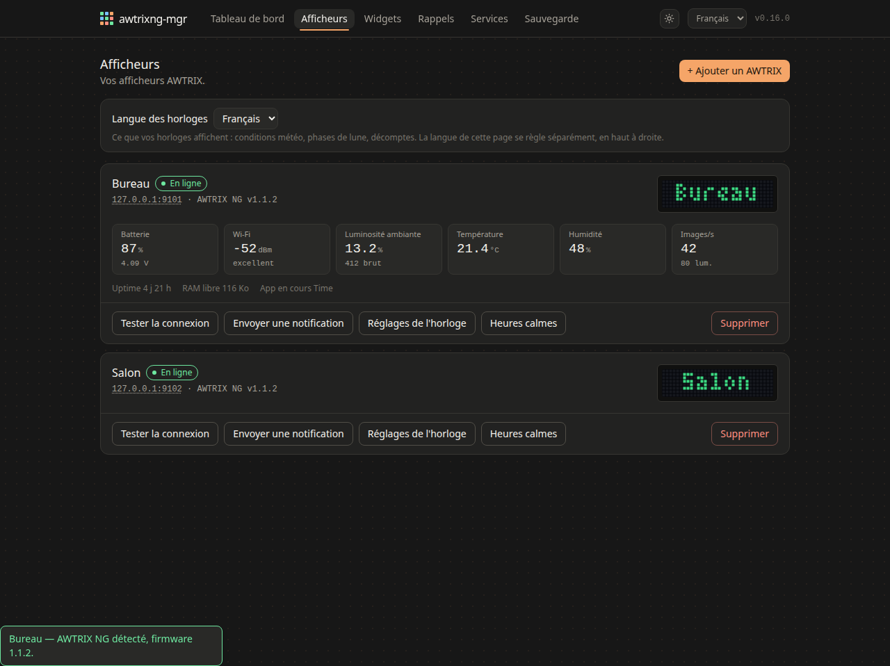
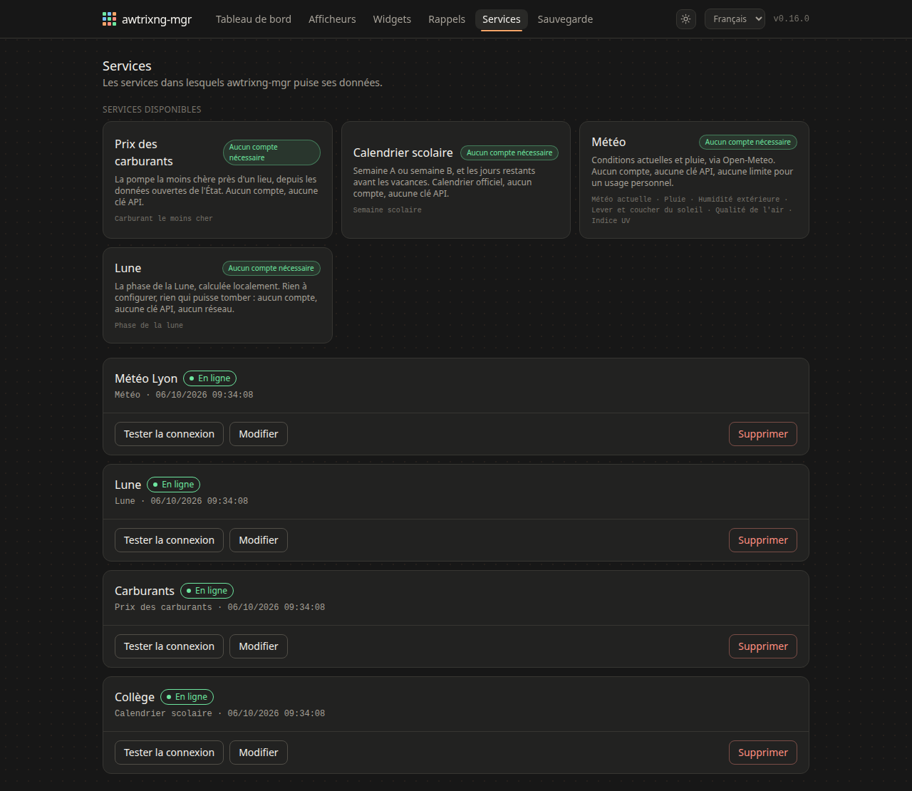
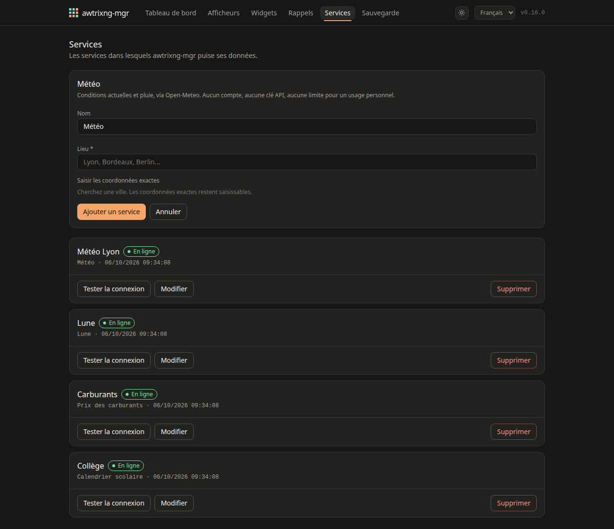
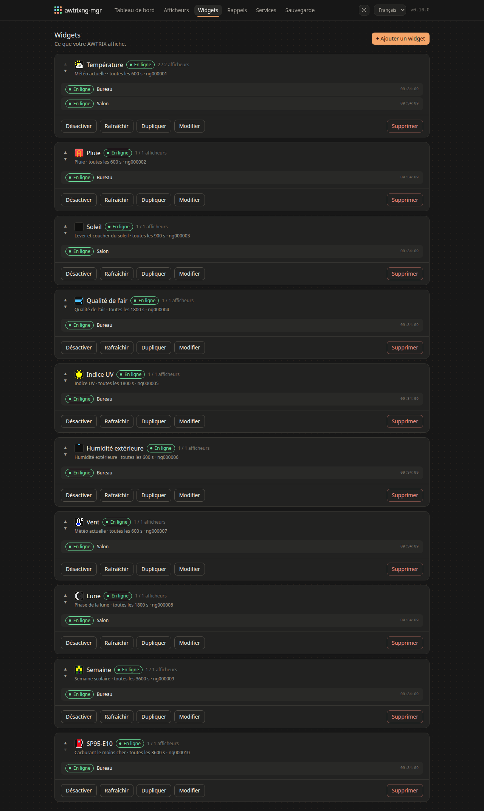

# Démarrage

De zéro à un widget sur la matrice. Comptez dix minutes, dont neuf à choisir
une ville.

## 1. Ajouter l'horloge

**Afficheurs → Ajouter un AWTRIX.** Le nom d'hôte ou l'adresse IP suffit ;
le port reste 80 sauf si vous l'avez changé.

Laissez l'identifiant et le mot de passe vides : AWTRIX NG sort d'usine sans
authentification (`authEnabled: false`). Ne les remplissez que si vous l'avez
activée sur l'horloge.

## 2. Vérifier qu'elle répond

**Tester la connexion.** L'horloge renvoie sa version et ses capteurs, qui
s'affichent aussitôt sur la carte.

Les six mesures sont celles que l'horloge montre dans sa propre interface, dans
le même ordre : vous pouvez comparer les deux pages sans rien traduire.

Si elle ne répond pas : [Dépannage](Depannage.md).

## 3. Ajouter un service

Un **service** est une source de données ; un **widget** est une façon de
l'afficher. Un service alimente autant de widgets que vous voulez, et n'est
interrogé qu'une fois pour tous.

Aucun des services livrés ne demande de compte ni de clé d'API. Pour la météo
et les carburants, il faut seulement choisir un lieu.

## 4. Créer un widget

**Widgets → Ajouter un widget.** Choisissez le service, puis ce qu'il doit
montrer.

L'aperçu à droite est **fidèle au pixel** : la police a été lue sur une vraie
horloge, caractère par caractère. Ce que vous voyez là est ce que la matrice
dessinera, défilement compris.

Trois choses à savoir tout de suite :

- **Une icône coûte 9 des 32 colonnes.** Décochez-la et le texte respire.
- La **grande police** remplit sept rangées sur huit : elle va de pair avec une
  barre en bas, et paraît trop haute sans.
- Le champ texte accepte `{{ variable }}`, et les variables disponibles sont
  listées sous l'aperçu.

## 5. Regarder

Le widget part sur l'horloge dans la seconde, puis à l'intervalle choisi. Il
prend sa place dans la rotation, après les apps natives.

Si l'horloge redémarre, elle perd les apps poussées — AWTRIX NG ne les
conserve pas. Elles reviennent toutes seules en moins de deux minutes :
awtrixng-mgr compare en continu ce qu'elle porte à ce qu'elle devrait porter.

## Clair ou sombre

Le bouton soleil/lune en haut à droite. Tant que personne n'y touche, la page
**suit le système** — claire le matin, sombre le soir, sans rien demander.
Cliquer épingle le choix, et il est retenu pour ce navigateur.

Les deux palettes sont celles d'**AWTRIX NG**, relevées dans l'interface que
le firmware sert lui-même plutôt qu'estimées sur une capture. Deux choses ne
suivent pas le thème, et c'est voulu :

- **les pastilles d'état** gardent le vert et le rouge, parce qu'ils disent si
  un widget atteint l'horloge et que c'est ce qu'on vient vérifier ;
- **la dalle reste noire**, dans les deux thèmes : c'est la photographie d'un
  panneau, et une LED éteinte l'est aussi à midi.

## Et ensuite

- [Widgets](Widgets.md) pour les options d'affichage en détail
- [Afficheurs](Afficheurs.md) pour régler l'horloge elle-même
- [Rappels](Rappels.md) pour un message à heure fixe
