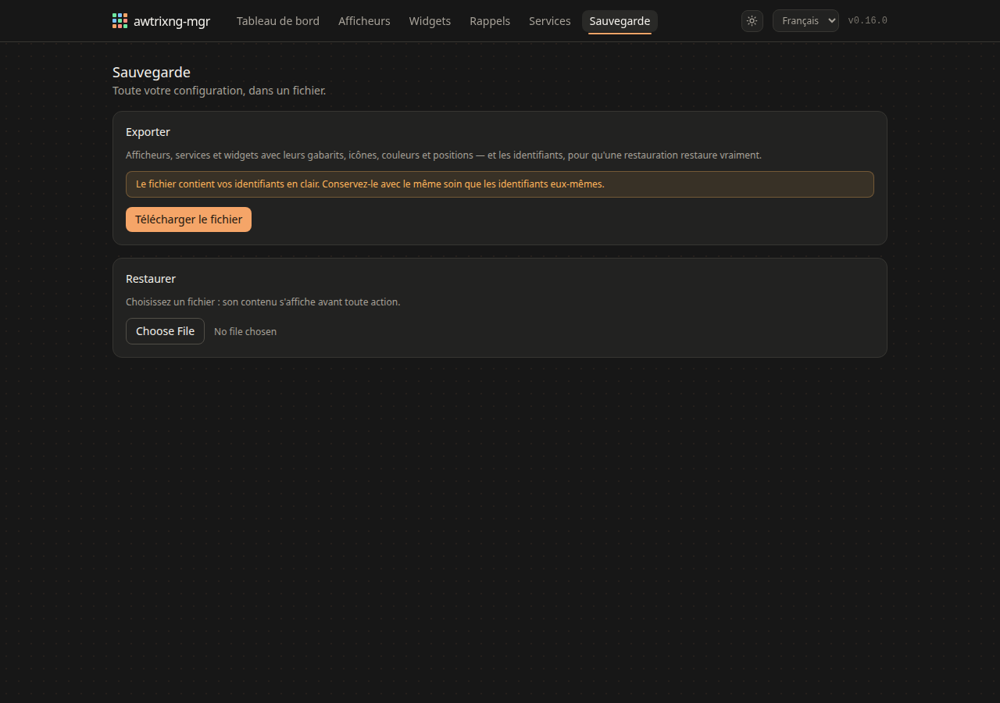

# Maintenance

Mettre à jour, sauvegarder, lire les journaux.

## Mettre à jour

```bash
cd /chemin/vers/awtrixng-mgr
git pull
docker compose up -d --build
```

Les migrations de base tournent au démarrage : un `git pull` suivi d'un
`up -d` suffit, et la configuration est conservée.

**Lisez l'entrée du [CHANGELOG](../../CHANGELOG.md)**
avant une montée de version mineure : c'est là que figure ce qui a été retiré.
Un widget dont le type n'existe plus refusera de se collecter, avec un message
qui dit de le supprimer — il ne se transformera pas en autre chose.

## Les numéros de version

| Niveau | Ce que ça veut dire pour vous |
|---|---|
| Correctif `0.1.x` | `git pull && docker compose up -d --build` |
| Mineur `0.x.0` | pareil, mais du neuf apparaît |
| Majeur `x.0.0` | **une action de votre part** est nécessaire |

## Sauvegarder



**Sauvegarde → Exporter.** Le fichier contient toute la configuration :
afficheurs, services, widgets, rappels.

> **Il contient les identifiants en clair.** Gardez-le comme vous garderiez les
> identifiants eux-mêmes. Ils sont rechiffrés à la restauration avec la clé de
> l'installation qui les reçoit.

La restauration **remplace** plutôt qu'elle n'ajoute : « restaurer » doit vouloir
dire « ressembler à la sauvegarde ». Tout se fait en une transaction, donc un
fichier malformé laisse la configuration précédente intacte.

Avant de restaurer, l'interface lit le fichier et dit ce qu'il porte — nombre
d'afficheurs, de services, de widgets, de rappels, et combien d'identifiants.
C'est ce qui empêche le mauvais fichier d'effacer une configuration qui
marche.

### Un fichier antérieur à la version 0.15.0

Les rappels n'y sont pas : le format ne les portait pas encore. Restaurer un
tel fichier **conserve les rappels déjà en place** plutôt que de les effacer —
un fichier qui ne peut rien dire des rappels ne donne pas l'ordre de les
supprimer. L'interface l'annonce avant de restaurer.

Leurs afficheurs sont rattachés **par adresse**, pas par numéro : tous les
afficheurs sont recréés à la restauration, et le « Bureau » supprimé puis le
« Bureau » recréé sont la même horloge. Un rappel qui sonnait sur une horloge
absente du fichier, lui, ne sonnera plus nulle part — il n'y a rien où le
rattacher.

## Lire les journaux

```bash
docker compose logs -f --tail 100 awtrixng-mgr-backend
```

Les secrets y sont masqués : chaînes de requête, en-têtes d'autorisation,
fragments JSON contenant un mot de passe ou un jeton.

Ce qui vaut la peine d'être cherché :

| Ligne | Ce qu'elle dit |
|---|---|
| `pushed app ng000007` | un widget est parti sur l'horloge |
| `removed orphan app` | la réconciliation a nettoyé |
| `display options no longer offered, ignored` | un widget enregistré portait une option retirée depuis |
| `device … unreachable` | l'horloge n'a pas répondu |

## Le journal de l'horloge elle-même

AWTRIX NG en tient un, ce qu'AWTRIX 3 ne faisait pas :

```bash
curl -s http://IP_DE_L_HORLOGE/api/v1/logs | python3 -m json.tool
```

Il donne le démarrage ligne par ligne. **Il ne dit rien quand le panneau
s'éteint** — une horloge trouvée noire ne laisse aucune trace.

## La place sur l'horloge

Icônes, mélodies, palettes et scripts partagent **512 Ko**. Une icône qui refuse
de s'installer peut l'être à cause d'autre chose :

```bash
curl -s "http://IP_DE_L_HORLOGE/api/v1/files?dir=/ICONS" | python3 -m json.tool
```
