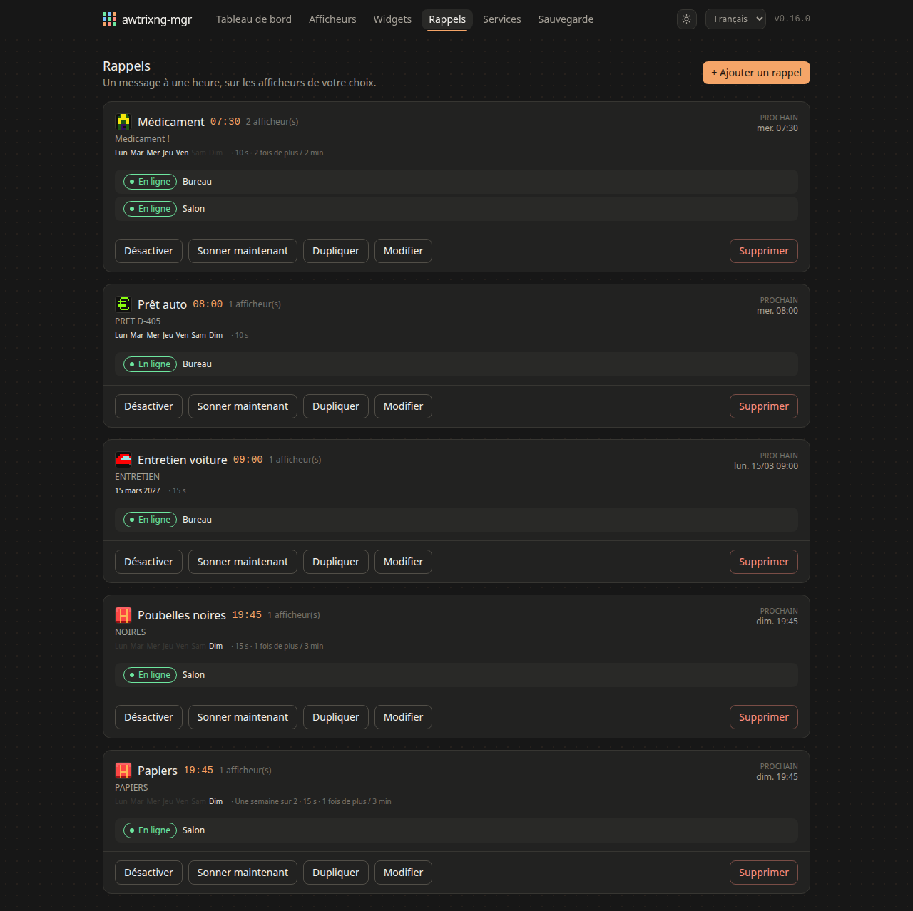
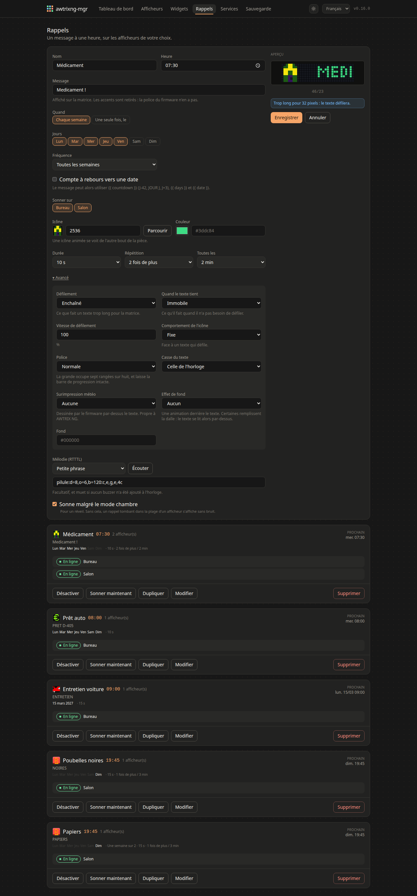
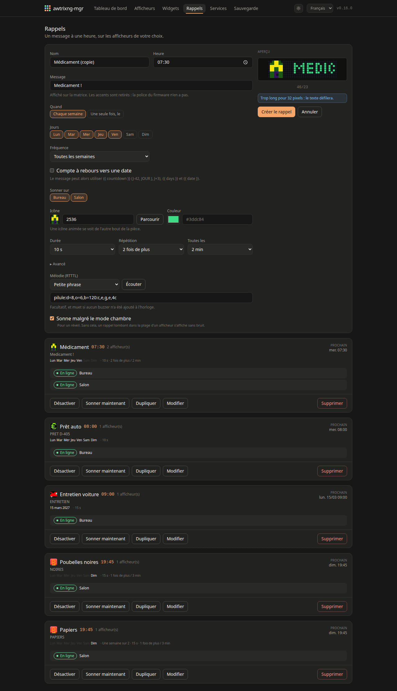

# Rappels

Un message à une heure fixe, qui **interrompt** la rotation au lieu d'attendre
son tour.

Ce n'est pas un widget, et volontairement : un widget se collecte à un
intervalle et prend sa place dans la boucle. Un rappel n'a rien en amont, part
à une heure d'horloge, et doit couper.

## Le réglage

**Les jours.** Du lundi au dimanche, et une périodicité : toutes les semaines,
une sur deux, jusqu'à une sur huit. Au-delà d'une semaine sur une, il faut une
**semaine d'ancrage** — sans elle, « une semaine sur deux » est une question à
deux réponses.

**Une date unique** remplace tout le reste : le rappel sonne ce jour-là et plus
jamais.

**Un décompte** change ce qu'il dit, pas quand il le dit. Le message peut alors
utiliser `{{ countdown }}`, `{{ days }}` et `{{ date }}`.

**La répétition** est aveugle : HTTP ne rapporte aucun appui sur un bouton,
donc awtrixng-mgr ne peut pas savoir si quelqu'un a vu. Il répète sans demander.

## Le son

Une mélodie RTTTL, jouée en ligne — rien à téléverser sur l'horloge. Le
firmware l'analyse et dit où elle a buté si elle est mal formée.

**Sonne pendant les heures calmes** : décoché par défaut, parce que c'est ce
que des heures calmes doivent vouloir dire. À cocher pour le réveil — celui qui
existe *pour* réveiller quelqu'un, et qu'un créneau 22:00-07:00 rendrait muet
le matin où il comptait.

## L'apparence

Le bloc **Avancé** d'un rappel est **le même que celui d'un widget**, au
contrôle près : police, casse du texte, comportement de l'icône, effet de fond,
surimpression météo, défilement, vitesse, et ce que fait un texte qui tient
dans la dalle. Voir [Widgets](Widgets.md) pour ce que chacun fait.

Trois différences, et elles tiennent toutes à la même chose — un rappel ne
porte aucune donnée :

- **pas de barre de progression ni de segments de semaine** : rien à mesurer ;
- **pas de « masquer si vide »** : rien qui puisse manquer ;
- **la surimpression vide veut dire *aucune***, alors que pour un widget elle
  veut dire « au choix du service ». Un rappel n'a pas de service.

Et le rappel garde ce que seul un rappel a : la répétition à quelques minutes
d'intervalle, la mélodie, et le droit de sonner pendant les heures calmes.

**La police ne gagne pas de place.** Les deux occupent le même nombre de
colonnes par caractère — la grande en occupe sept rangées sur huit au lieu de
cinq, c'est tout. Un message qui défile en normale défile aussi en grande.

**La casse change la largeur.** Une horloge d'origine écrit en capitales, et
une capitale est une colonne plus large que la minuscule qu'elle remplace.
L'aperçu en tient compte : il mesure ce que l'horloge va vraiment dessiner.

## La matrice s'allume

Avant chaque rappel, awtrixng-mgr allume le panneau et **le laisse allumé**.

Parce que le firmware ne le fait pas : la clé `wakeup` des notifications est
acceptée et sans effet, mesuré. Panneau éteint, la notification est acceptée,
l'image est composée — et rien ne s'allume. Elle serait entendue et jamais vue.

Conséquence assumée : une horloge éteinte peut se rallumer d'elle-même la nuit
si un rappel tombe. Remettre l'état d'avant cacherait l'alerte au moment précis
où elle compte.

## Dupliquer

Pratique pour une série proche — même message, autre heure, autres jours.
