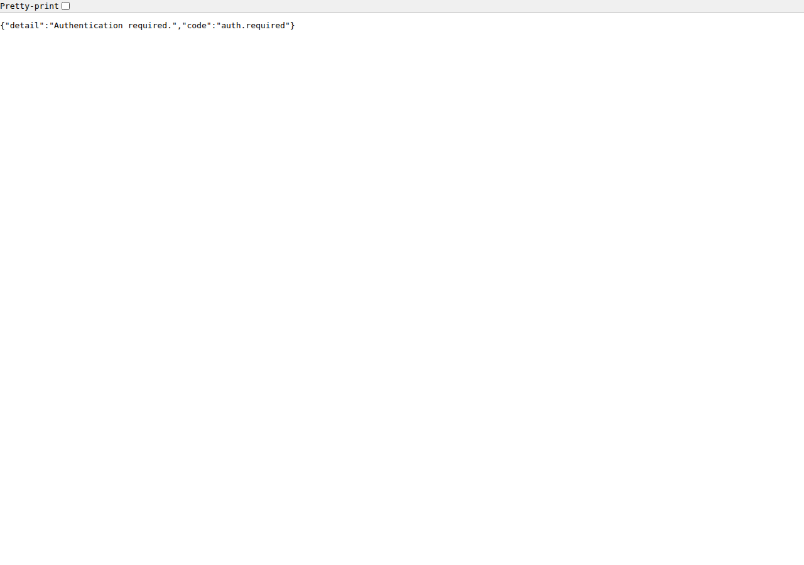

# Sécurité

Le modèle de menace d'awtrixng-mgr : un LAN domestique, derrière un reverse-proxy,
et une sauvegarde qu'on ne veut pas voir partir. Pas une exposition sur
Internet.

## Le mot de passe



Par défaut awtrixng-mgr est **ouvert**. Renseigner `AWTRIXNG_PASSWORD` ferme
toutes les routes sauf `/api/health`.

```bash
# dans .env
AWTRIXNG_PASSWORD=un-mot-de-passe-long-et-unique
```

Puis `docker compose up -d`.

**C'est recommandé dès que vous utilisez la page Sauvegarde** : l'export
contient les clés API en clair, et sans mot de passe il est téléchargeable par
quiconque atteint l'application.

| Caractéristique | Valeur |
|---|---|
| Un seul mot de passe, pas de comptes | une installation domestique a un propriétaire |
| Session | cookie `HttpOnly`, 30 jours |
| Comparaison | à temps constant, 1 s d'attente sur échec |
| Routes protégées | toutes sauf `/api/health` et les trois routes d'authentification |
| Oubli du mot de passe | changez la variable, redémarrez — aucun blocage possible |

La documentation de l'API (`/api/docs`) n'est **pas** une exception : elle est
fermée elle aussi.

## Le fichier `.env`

Il vit à la racine du dépôt **sur la VM**, à côté de `docker-compose.yml`.

| Variable | Sensible ? |
|---|---|
| `TZ`, `LOG_LEVEL` | non |
| `AWTRIXNG_SECURE_COOKIE` | non |
| `AWTRIXNG_PASSWORD` | **oui** — accès à toute l'application |
| `AWTRIXNG_SECRET_KEY` | **oui** — déchiffre les credentials en base |

### Il ne doit jamais partir dans Git

`.env` est couvert par `.gitignore`. Vérifiez-le plutôt que de le supposer :

```bash
git check-ignore -v .env          # doit citer une ligne de .gitignore
git ls-files --error-unmatch .env # doit échouer : le fichier n'est pas suivi
git log --all --oneline -- .env   # doit ne rien renvoyer
```

Les trois ensemble disent : ignoré, non suivi, jamais commité.

### Permissions

```bash
chmod 600 .env
ls -l .env        # -rw------- et rien d'autre
```

En `644`, tout compte du système peut lire votre mot de passe.

### `.env` et `.env.example`

| | `.env` | `.env.example` |
|---|---|---|
| Versionné | **non** | oui |
| Contenu | vos vraies valeurs | des variables **vides** et des commentaires |
| Rôle | configurer | documenter ce qui existe |

`.env.example` ne doit **jamais** contenir une valeur réelle. C'est un
gabarit : il est lu par tous ceux qui voient le dépôt.

### Dans les journaux

awtrixng-mgr masque les en-têtes d'autorisation, les jetons et les paramètres
d'URL qui ressemblent à des secrets. Le mot de passe de l'interface
n'apparaît jamais dans les journaux — c'est vérifié.

En revanche, `docker compose config` **affiche les valeurs résolues**. Ne
collez pas sa sortie dans un ticket sans la relire.

### Dans les sauvegardes

L'export JSON contient les credentials **en clair**. Le fichier porte un
avertissement en première ligne. Conservez-le comme vous conserveriez les clés
elles-mêmes : pas dans un dossier partagé, pas en pièce jointe.

## Un secret a fuité

**Considérez-le compromis immédiatement.** Le retirer de Git ne suffit pas :
il reste dans l'historique, dans les clones déjà faits, dans les caches, et
peut-être dans un index.

Dans l'ordre :

1. **Révoquez ou changez le secret** à la source — c'est la seule étape qui
   protège vraiment.
   - `AWTRIXNG_PASSWORD` : changez-le dans `.env`, `docker compose up -d`.
     Les sessions en cours restent valides tant que la clé de session ne change
     pas ; pour les couper toutes, supprimez aussi `/data/secret.key` — mais
     cela rend les credentials en base illisibles, alors exportez avant.
   - Clé API d'un service : révoquez-la chez le fournisseur, créez-en une
     nouvelle, saisissez-la dans l'interface.
2. **Ensuite seulement**, nettoyez l'historique si le secret est parti dans un
   dépôt distant.
3. **Vérifiez ce qui a pu être atteint** avec ce secret pendant qu'il était
   valide.

L'ordre compte : nettoyer d'abord et révoquer ensuite laisse une fenêtre
pendant laquelle le secret exposé fonctionne encore.

## L'architecture d'accès

```text
Navigateur
    │  HTTPS
    ▼
  Caddy          awtrixng-mgr.lan, termine TLS
    │  réseau docker « home.docker »
    ▼
awtrixng-mgr-frontend:80     nginx : sert l'interface, proxifie /api
    │
    ▼
awtrixng-mgr-backend:8000
```

**Aucun port n'est publié sur l'hôte.** Caddy est le seul point d'entrée. C'est
ce qui fait qu'un `curl localhost:8000` depuis la VM échoue, et c'est voulu :
la surface exposée se règle à un seul endroit.

Le saut interne Caddy → nginx est en clair. Sans importance : il ne quitte pas
la machine. C'est aussi pourquoi le drapeau `Secure` du cookie est un
**réglage** et non une déduction du protocole vu par le backend.

## Ce qu'awtrixng-mgr ne protège pas

- **Les horloges elles-mêmes.** Leur API HTTP est ouverte sur le LAN ; leur
  firmware sait demander une authentification, awtrixng-mgr sait la fournir.
- **Le contenu de la base** face à un accès root sur la VM. Le chiffrement des
  credentials vise la copie d'un fichier `.db`, pas l'administrateur.
- **Ce wiki**, réglé en accès public : lisible sans authentification par
  quiconque est **sur le LAN**, même si le dépôt reste privé. Gogs n'étant pas
  exposé sur Internet, le périmètre s'arrête au réseau domestique — ce qui
  reste une raison suffisante de n'y écrire aucune valeur réelle.
