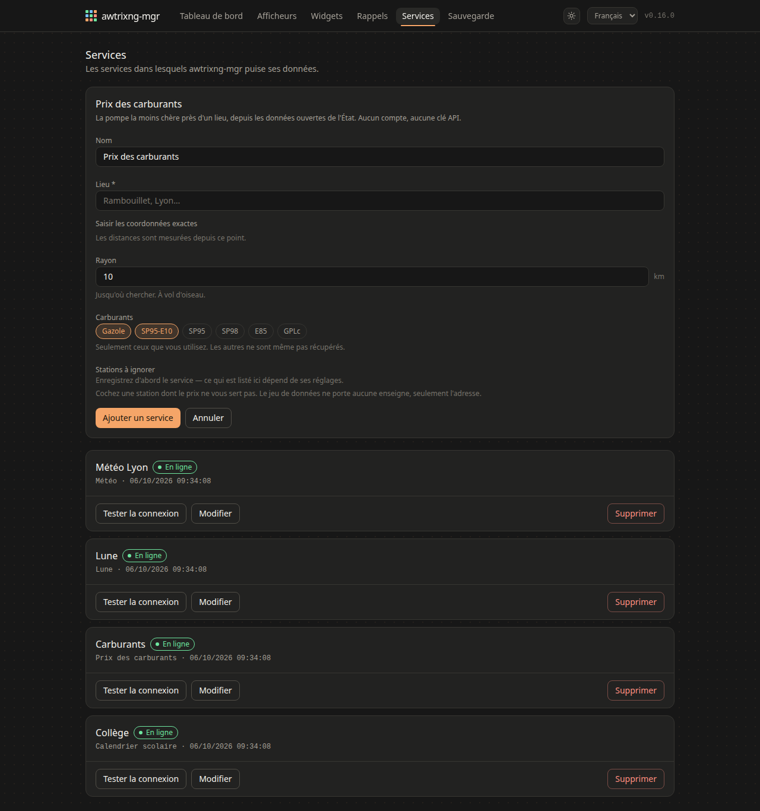
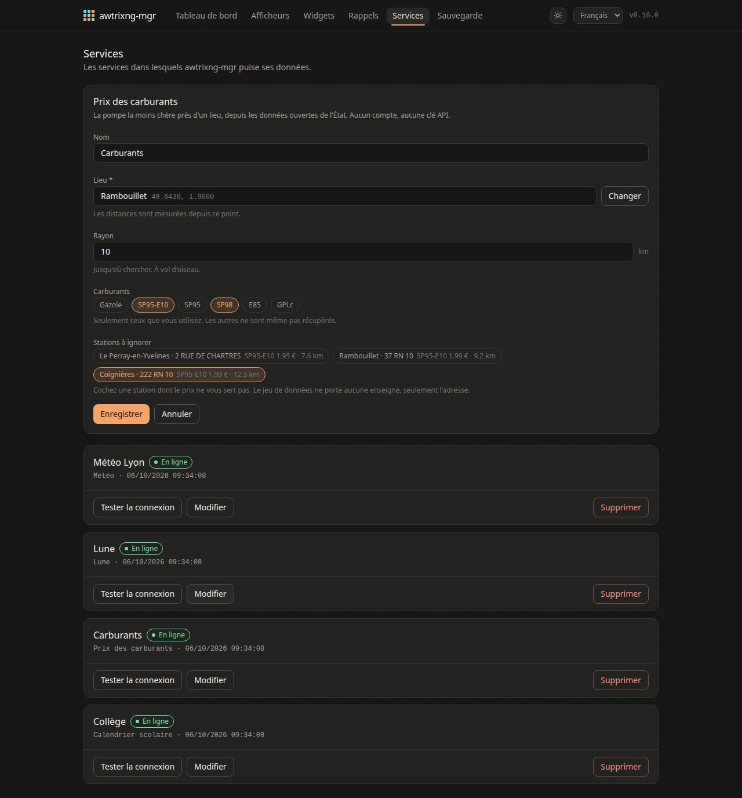

# Widget Carburants

Le prix le plus bas autour d'un point, depuis les données ouvertes de l'État.
Aucun compte, aucune clé.

## Le réglage

Un lieu, un rayon, et les carburants à suivre. Un widget par carburant : un
prix sans savoir lequel n'aide personne.

La liste des stations trouvées sert à en **exclure** une — celle qui annonce un
prix qu'elle ne pratique pas, ou celle devant laquelle vous ne passerez jamais.

## Deux carburants côte à côte

C'est le cas normal, et c'était un piège : deux widgets avec la même icône, la
même couleur, et souvent le même nombre.

Le gabarit par défaut est donc `{{ short }} {{ price }}`, **icône décochée** —
`E10 1.99` et `98 1.99` tiennent fixes. Avec l'icône, tout défile :
`{{ fuel }}` donne « SP95-E10 », qui ne rentre nulle part.

## La couleur dit l'âge du prix

| | |
|---|---|
| vert | publié aujourd'hui ou hier |
| ambre | dans le mois |
| gris | plus vieux que ça |

Ce n'est pas une couleur d'alerte : un prix d'un mois peut être exact et
seulement non reconfirmé. Mais une station qui a cessé de publier garde son
dernier chiffre et continue de paraître la moins chère.

**À prix égal, la station choisie est celle qui a publié le plus récemment**,
puis la plus proche. Mesuré autour de Lille : huit stations à 1.99 €, et celle
retournée datait de six mois alors que sept autres avaient publié le matin
même.

Une station réellement moins chère avec un vieux prix reste affichée — l'écarter
serait décider à votre place qu'un prix que vous pouvez aller vérifier est faux.
La couleur et `{{ age_days }}` vous laissent juger.
