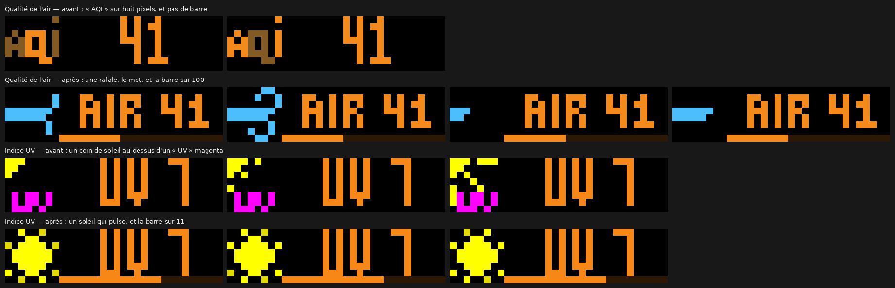

# Widget Météo

Six widgets, un seul service, un seul appel. Tous viennent d'Open-Meteo : pas
de compte, pas de clé, pas de limite pour un usage personnel.

## Météo actuelle

La température, et le ciel qu'il fait.

`{{ temp | round }}°` par défaut. Avec l'icône, il reste 23 colonnes :
`{{ temp | round }}°C` tient, `{{ temp | round }}° {{ condition }}` défile.
Décochez l'icône et vous gagnez neuf colonnes.

**La surimpression est automatique** : quand il pleut dehors, il pleut sur la
matrice. Le firmware la dessine par-dessus le texte, à partir du code météo —
bruine, pluie, neige, orage, et un cadre de givre pour la pluie verglaçante.

Un ciel dégagé ne dessine rien, et c'est voulu : une matrice qui bruine sous un
ciel sec serait pire qu'une matrice qui ne dessine rien.

## Pluie

Le risque de pluie, et une barre.

**L'icône et la couleur annoncent ; la surimpression constate.** À 98 % de
risque sous un ciel encore sec, le nuage vous prévient et la matrice ne pleut
pas. À 31 % alors qu'il bruine, elle bruine.

Ce n'est pas une incohérence mais deux questions : *qu'est-ce qui arrive* et
*qu'est-ce qui tombe*. Personne ne le devine en regardant une horloge, d'où
cette phrase.

## Humidité extérieure

L'eau dans l'air, qui n'est pas la même question que la pluie à venir.

La couleur suit une échelle avec un **plateau voulu entre 40 et 60 %** : dans
la zone confortable, rien ne bouge. Elle vire à l'ambre quand l'air s'assèche,
au bleu puis au violet quand il sature.

## Lever et coucher du soleil

L'heure du prochain des deux, et **une barre qui montre ce qu'il reste de
jour**. L'heure dit *quand*, la barre dit *combien*.

La nuit, la barre disparaît : une barre à 0 % ou 100 % toute la nuit se lirait
comme une mesure plutôt que comme « sans objet ».

## Qualité de l'air

L'indice européen, de 0 à 100 — et **il dépasse 100**, parce qu'il est le
maximum de cinq polluants. Une barre pleine veut donc dire « hors échelle »,
ce qui est la lecture honnête.

L'icône est une **rafale de vent**, la même quelle que soit la qualité de
l'air. C'est elle qui dit *de quoi on parle* ; la bande, elle, est dite par la
couleur — du texte, de la barre, et du fond de la barre.

Le gabarit par défaut est `AIR {{ aqi }}` et non `{{ aqi }}` : « 41 » tout seul
n'est pas une lecture. Le mot coûte la petite police, parce que `AIR 100` ne
tient pas en grande à côté d'une icône — mesuré sur la dalle, il se met à
défiler.

Les cinq polluants sont disponibles comme variables : `pm2_5`, `pm10`, `no2`,
`o3`, `so2`.

## Indice UV

L'échelle de l'OMS. La barre est rapportée à **11**, au-delà duquel l'indice
n'a plus de bande et s'appelle « extrême » — une barre pleine le dit.

L'icône est un **soleil dont les rayons pulsent**, jaune à tous les indices :
un soleil est jaune quel qu'il soit, et c'est la couleur de « UV 7 » et de la
barre qui dit la bande.

Les deux widgets affichaient auparavant une icône qui épelait son propre nom —
« AQI » en trois lettres sur huit pixels, « UV » en magenta sous un coin de
soleil. Sur une dalle, trois lettres de huit pixels ne se lisent pas. Le mot
est passé dans le texte, où une police sait le dessiner.

## Ce qui n'existe plus

Le widget **Pollen** a été retiré : un compte de grains par mètre cube ne dit
rien sans échelle, et l'échelle officielle n'existe pas. La donnée reste dans
la réponse d'Open-Meteo si elle revient un jour avec de quoi la lire.
